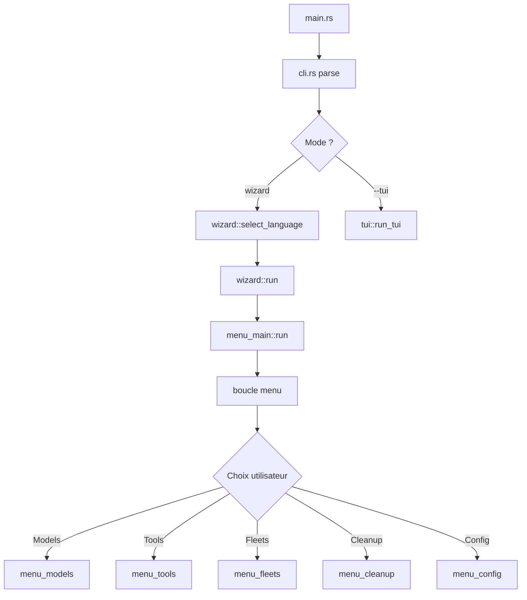
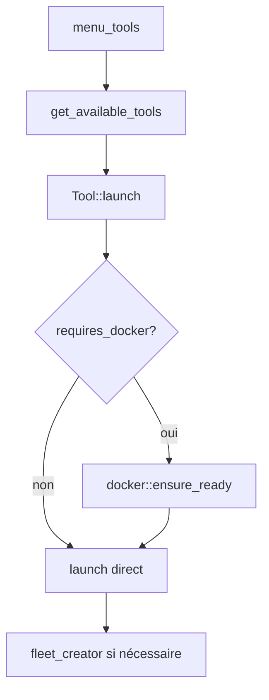

# Architecture de wzllama

## Vue d'ensemble

wzllama suit une architecture modulaire en couches avec séparation claire des responsabilités:

```
┌─────────────────────────────────────────────────────────┐
│                    CLI ENTRY POINT                        │
│                     src/main.rs                           │
└─────────────────────────────────────────────────────────┘
                            │
                            ▼
┌─────────────────────────────────────────────────────────┐
│                    CLI PARSER                              │
│                     src/cli.rs                            │
│  - Analyse des arguments (clap)                          │
│  - Routing vers TUI ou Wizard mode                      │
│  - Gestion des commandes globales                       │
└─────────────────────────────────────────────────────────┘
                            │
            ┌───────────────┴───────────────┐
            ▼                               ▼
┌───────────────────────┐       ┌───────────────────────┐
│      TUI MODE         │       │    WIZARD MODE        │
│     src/tui/          │       │    src/wizard/        │
│  - ratatui/crossterm  │       │  - dialoguer menus    │
│  - Widget-based       │       │  - CLI interactions   │
│  - Real-time updates  │       │  - Alternate screen   │
└───────────────────────┘       └───────────────────────┘
                            │
                            ▼
┌─────────────────────────────────────────────────────────┐
│                    BUSINESS LOGIC                       │
│  ┌──────────────┐  ┌──────────────┐  ┌──────────────┐   │
│  │   config/    │  │    core/     │  │    tools/    │   │
│  │ - i18n        │  │ - ollama_api │  │ - Tool trait │  │
│  │ - state       │  │ - hardware   │  │ - Implements │  │
│  │ - env config  │  │ - estimation  │  │ - docker     │  │
│  └──────────────┘  └──────────────┘  └──────────────┘   │
└─────────────────────────────────────────────────────────┘
                            │
                            ▼
┌─────────────────────────────────────────────────────────┐
│                    DISPLAY LAYER                          │
│                     src/display.rs                        │
│  - Formatters de sortie                                  │
│  - Helpers de menu (max_length dynamique)                 │
│  - Terminal utilities                                    │
└─────────────────────────────────────────────────────────┘
```

## Structure des modules Rust

### Module principal (src/)

```
src/
├── main.rs           # Point d'entrée (4 lignes)
├── lib.rs            # Bibliothèque partagée
├── cli.rs            # Parsing CLI et routing
├── display.rs        # Utilities d'affichage
├── error.rs          # Gestion d'erreurs
│
├── config/           # Configuration et état
│   ├── mod.rs        # Exports
│   ├── i18n.rs       # Internationalisation (318 clés FR)
│   ├── state.rs      # État persistant (WzllamaState)
│   ├── env.rs        # Configuration environnement (.yaml -> .env)
│   ├── paths.rs      # Gestion des chemins (~/.wzllama/)
│   ├── logging.rs    # Logging setup
│   ├── templates.rs  # Templates intégrés
│   ├── fleets.rs     # Gestion des flottes OpenClaw
│   ├── shells.rs     # Shell completions (bash, zsh, fish)
│   └── mod.rs
│
├── core/             # Logique métier centrale
│   ├── mod.rs
│   ├── hardware.rs   # Détection CPU/RAM/GPU
│   ├── ollama_api.rs # API Ollama (list, pull, delete, create)
│   ├── ollama_models.rs # Modèles et ranking par usage
│   ├── ollama_doctor.rs # Diagnostics
│   ├── estimation.rs # Estimation tokens/timing
│   ├── shell.rs      # Shell utilities
│   └── system.rs     # System info (RAM, VRAM disponible)
│
├── wizard/           # Wizard CLI mode
│   ├── mod.rs        # Exports
│   ├── menu_main.rs  # Menu principal + alternate screen
│   ├── menu_models.rs # Gestion des modèles
│   ├── menu_tools.rs # Lancement des outils
│   ├── menu_fleets.rs # Gestion des flottes
│   ├── menu_cleanup.rs # Nettoyage
│   ├── menu_config.rs # Configuration
│   ├── cleanup_fleets.rs # Suppression flottes
│   ├── cleanup_models.rs # Suppression modèles
│   ├── cleanup_tools.rs # Suppression outils
│   ├── configurator.rs # Config avant création modèle
│   ├── fleet_creator.rs # Création flotte interactive
│   ├── fleet_templates.rs # Templates de flottes
│   ├── setup_models.rs # Installation modèles initiaux
│   └── estimator.rs  # Estimation ressources
│
├── tui/              # Terminal UI mode
│   ├── mod.rs        # Entry point
│   ├── app.rs        # Application state
│   ├── ui.rs         # Rendering
│   ├── event.rs      # Event handling
│   ├── screens.rs    # Screen management
│   ├── widgets.rs    # Custom widgets
│   └── terminal.rs   # Terminal utilities
│
└── tools/            # Outils IA intégrés
    ├── mod.rs        # Registry + ToolInfo
    ├── tool_trait.rs # Trait Tool (id, name, install, launch)
    ├── docker.rs     # Docker detection/management
    ├── ollama.rs     # Ollama tool
    ├── openclaw.rs   # OpenClaw tool + fleet support
    ├── open_webui.rs # Open WebUI tool
    ├── claude_code.rs
    ├── codex.rs
    ├── copilot_cli.rs
    ├── droid.rs
    ├── hermes.rs
    ├── opencode.rs
    ├── pi.rs
    └── pool.rs
```

## Flux de données principal

### Démarrage en mode Wizard



### Gestion d'un outil (ex: OpenClaw)



## Patterns et conventions

### Gestion des états persistés

```rust
// src/config/state.rs
pub struct WzllamaState {
    pub language: Option<String>,
    pub last_model: Option<String>,
    pub installed: InstalledTools,
    pub fleets: Vec<String>,
}

pub struct InstalledTools {
    pub ollama: bool,
    pub open_webui: bool,
    pub openclaw: bool,
    // ... autres outils
}
```

### Trait Tool (pattern Strategy)

```rust
pub trait Tool {
    fn id(&self) -> &str;
    fn name(&self) -> &str;
    fn description(&self, i18n: &I18n) -> String;
    fn install(&self) -> Result<()>;
    fn launch(&self, i18n: &I18n, state: &WzllamaState, model: Option<&str>) -> Result<()>;
    fn supports_fleets(&self) -> bool { false }
    fn requires_docker(&self) -> bool { false }
}
```

### Menu avec Escape handling

```rust
// Pattern utilisé dans tous les menus wizard
let sel = match Select::new()
    .with_prompt(i18n.t("key"))
    .items(&items)
    .interact_opt()? {
    Some(s) => s,
    None => return Ok(()), // Escape/Ctrl-C pressed
};
```

### Configuration dynamique terminal

```rust
// src/display.rs
pub fn menu_max_items(items_count: usize, reserved_lines: usize) -> usize {
    let (_, term_height) = get_terminal_size();
    let max = (term_height as usize).saturating_sub(reserved_lines);
    std::cmp::min(items_count, std::cmp::max(3, max))
}
```